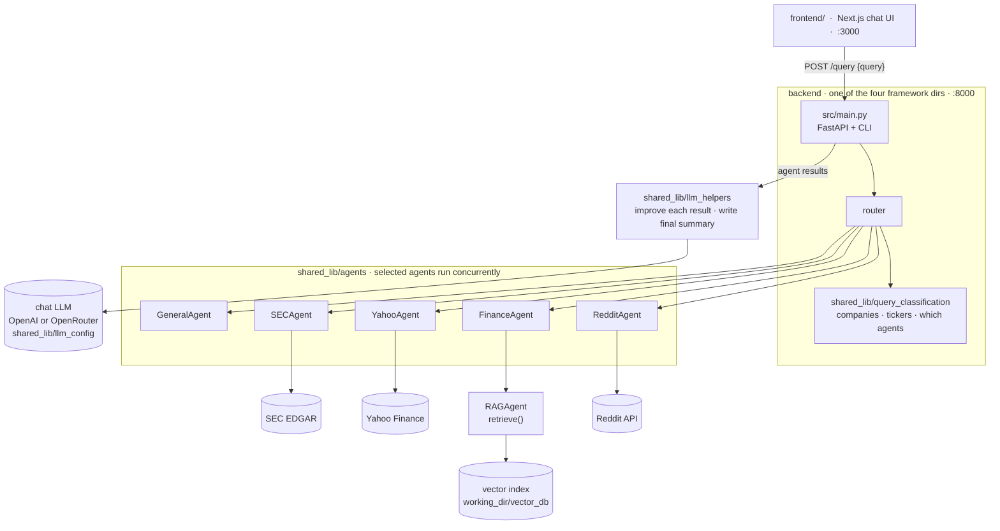
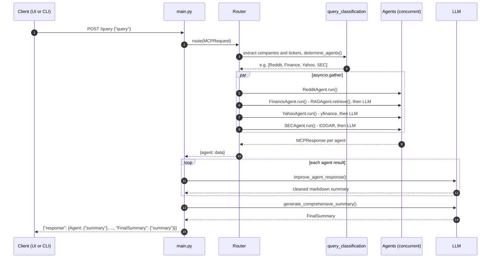
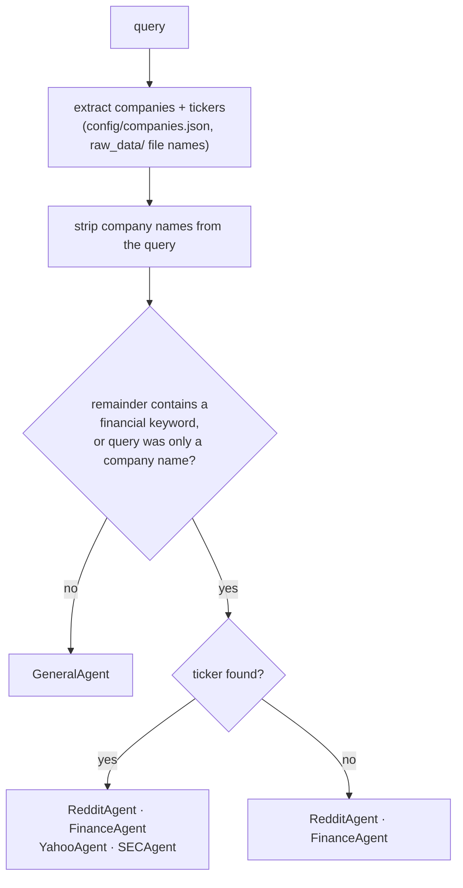
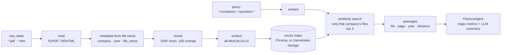

# FinanceAgents

A multi-agent financial analysis system implemented **four times over one shared core**, once per agent framework: **LangChain**, **CrewAI**, **LlamaIndex**, and **AG2** (formerly AutoGen). A Next.js web UI sits in front of whichever backend is running.

Ask a question such as `Tell me about Tesla stock` and the system:

1. Extracts company names and tickers from the query and decides which agents apply.
2. Runs the selected agents concurrently: Reddit sentiment, internal filings (RAG), Yahoo Finance statistics, SEC EDGAR metrics.
3. Cleans up each agent's output with an LLM, then writes one comprehensive summary.

## Repository layout

```
FinanceAgents/
├── shared_lib/            # The actual logic: agents, MCP schemas, routing rules, LLM + embedding config
│   ├── agents/            # RAGAgent, FinanceAgent, YahooAgent, SECAgent, RedditAgent, GeneralAgent
│   ├── query_classification.py   # deterministic company/ticker extraction + agent selection
│   ├── llm_config.py      # OpenAI / OpenRouter provider selection
│   └── embeddings.py      # cached HuggingFace embedding model
├── config/companies.json  # company -> ticker map and financial keywords (drives routing)
├── raw_data/              # 10-K / 10-Q filings (PDF or SEC .htm) indexed by RAGAgent
├── langchain_agents/      # thin framework shells: src/main.py (FastAPI + CLI) + a router
├── crewai_agents/
├── llamaindex_agents/     # also carries LlamaIndex-native RAG / Yahoo / Reddit agents
├── ag2_agents/            # also carries an AG2 GroupChat demo
├── frontend/              # Next.js chat UI
├── requirements.txt       # shared Python deps (each implementation adds its framework on top)
└── env_file               # template for env.all (API keys, LLM provider)
```

The four implementations are meant to behave identically. Agent logic, prompts, and routing live in `shared_lib/`, so a change there changes all four. Only orchestration differs per directory.

## Design

### System overview



`FinanceAgent`, `YahooAgent`, `SECAgent`, and `GeneralAgent` also call the same chat LLM for their own summaries. The result travels back up the same path as `{"response": {AgentName: {"summary": ...}}}`; see the sequence diagram below.

The four framework directories each provide the `main.py` + router box; everything below it is shared, so swapping the backend changes nothing the UI can see.

## How it works

### Agents

Every agent is a class with `run(MCPRequest) -> MCPResponse` (`shared_lib/schemas.py`). That uniform contract is what lets the four routers share dispatch code.

| Agent | What it does | Source | LLM call |
|-------|--------------|--------|----------|
| **RAGAgent** | Retrieves the most relevant passages from the filings in `raw_data/` for a query, per company | Vector index (Chroma, or LlamaIndex storage in `llamaindex_agents`) over HuggingFace `all-MiniLM-L6-v2` embeddings | No |
| **FinanceAgent** | Analyst summary of the internal filings, built on `RAGAgent.retrieve()` plus regex metric extraction | RAGAgent | Yes |
| **YahooAgent** | 30-day price statistics (min/max/mean, change, volatility) with a short analysis | `yfinance` | Yes |
| **SECAgent** | Latest revenue, net income, assets, liabilities, equity from XBRL company facts | SEC EDGAR API | Yes |
| **RedditAgent** | Recent r/stocks posts and comments mentioning the company | Reddit via PRAW | No |
| **GeneralAgent** | Answers non-financial questions | LLM only | Yes |

### Request flow (same in all four)



Both LLM passes use whatever `LLM_PROVIDER` / `LLM_MODEL` select; with no key configured they fall back to the raw agent output.

Routing rules (`determine_agents`):



| Query | Agents |
|-------|--------|
| Financial, with a known ticker (`AAPL`, `Tell me about Tesla stock`) | Reddit, Finance, Yahoo, SEC |
| Financial, no known ticker (`What is a good dividend stock?`) | Reddit, Finance |
| Not financial (`apple pie recipe`) | General |

"Financial" is judged on the query *after* company names are stripped, against the keyword list in `config/companies.json`. A bare company name counts as financial.

### Where the implementations differ

| Directory | Orchestration in `main.py` | Framework-specific extras |
|-----------|----------------------------|---------------------------|
| `langchain_agents` | Deterministic router over the shared agents | Shared agents use LangChain loaders, Chroma, HuggingFace embeddings |
| `crewai_agents` | Deterministic router (`crewai_router.py`) | `crew_agent.py` wraps each agent as a CrewAI tool; a reference, not used by `main.py` |
| `llamaindex_agents` | Deterministic router | Its own `rag_agent.py` (`VectorStoreIndex`), `finance_agent.py`, `yahoo_agent_enhanced.py` (CSV export), `reddit_agent.py` (`asyncpraw`) |
| `ag2_agents` | Deterministic router | `ag2_agent.py`: AG2 `ConversableAgent` + `GroupChat` demo where an LLM coordinator picks tools; run standalone, costs far more tokens |

All four listen on **port 8000**, expose the same `POST /query`, and start an interactive CLI in the same process. Run one backend at a time.

## Quick start

### 1. Python environment

One conda env serves all four implementations. Nothing is pinned to conflicting versions, so install the four requirement files in a single `pip` call:

```bash
conda create -y -n financeagents python=3.11
conda activate financeagents
cd FinanceAgents
pip install -r langchain_agents/requirements.txt \
            -r crewai_agents/requirements.txt \
            -r llamaindex_agents/requirements.txt \
            -r ag2_agents/requirements.txt
```

The first install is slow: it pulls `torch` and the embedding model's toolchain. Python 3.11 is recommended; 3.13 lacks wheels for some of the ML dependencies.

### 2. Keys

Copy the template and fill it in. `env.all` is gitignored.

```bash
cp env_file env.all
```

Minimum: one LLM key. Either

```env
LLM_PROVIDER=openai
OPENAI_API_KEY=sk-...
```

or, to use any model through [OpenRouter](https://openrouter.ai):

```env
LLM_PROVIDER=openrouter
OPENROUTER_API_KEY=sk-or-v1-...
LLM_MODEL=deepseek/deepseek-chat      # optional; any OpenRouter model id
```

Optional: `REDDIT_CLIENT_ID` / `REDDIT_CLIENT_SECRET` for the Reddit agent (it fails gracefully without them), and `HF_TOKEN` to avoid anonymous rate limits when the embedding model is first downloaded.

### 3. Run a backend

Always run from the implementation's own directory. The vector index and logs are written relative to the working directory.

```bash
cd langchain_agents            # or crewai_agents / llamaindex_agents / ag2_agents
env $(cat ../env.all) python src/main.py
```

This starts the FastAPI server on `http://localhost:8000` and an interactive CLI in the same terminal:

```
Enter your question: AAPL
```

The first run builds the vector index from `raw_data/`, which takes roughly a minute for the Chroma implementations and a few minutes for LlamaIndex. Later runs load it and only index files that are new.

Query the API from another terminal:

```bash
curl -X POST http://localhost:8000/query \
     -H "Content-Type: application/json" \
     -d '{"query": "Tell me about Tesla stock"}'
```

### 4. Run the web UI

Requires Node 18 or newer. With a backend running on port 8000:

```bash
cd frontend
npm ci              # first time only
npm run dev         # http://localhost:3000
```

The chat page posts to the backend and renders the final summary on top with each agent's section as a collapsible card. See [frontend/README.md](./frontend/README.md).

## API

| Endpoint | Available in | Purpose |
|----------|--------------|---------|
| `POST /query` `{"query": "..."}` | all four | Run the pipeline |
| `GET /health` | llamaindex, ag2 | Liveness and version |
| `GET /agents` | llamaindex, ag2 | List agents |
| `GET /docs` | all four | Swagger UI |

`POST /query` response:

```json
{
  "response": {
    "RedditAgent":  {"summary": "..."},
    "FinanceAgent": {"summary": "..."},
    "YahooAgent":   {"summary": "..."},
    "SecAgent":     {"summary": "..."},
    "FinalSummary": {"summary": "..."}
  }
}
```

Summaries are markdown. For a non-financial query the response holds only `GeneralAgent`. Agents that fail or return nothing are omitted.

## Configuration

### Environment variables

| Variable | Default | Purpose |
|----------|---------|---------|
| `LLM_PROVIDER` | `openai` | `openai` or `openrouter`. Auto-selects `openrouter` when only `OPENROUTER_API_KEY` is set. |
| `OPENAI_API_KEY` | | Key for the `openai` provider |
| `OPENROUTER_API_KEY` | | Key for the `openrouter` provider |
| `LLM_MODEL` | `gpt-3.5-turbo` / `deepseek/deepseek-chat` | Chat model for every LLM call, per provider |
| `OPENAI_BASE_URL`, `OPENROUTER_BASE_URL` | | Override endpoints |
| `OPENROUTER_SITE_URL`, `OPENROUTER_APP_NAME` | | Optional attribution headers for OpenRouter's dashboard |
| `EMBEDDING_MODEL` | `all-MiniLM-L6-v2` | HuggingFace embedding model for RAG. Changing it requires deleting the existing index. |
| `HF_TOKEN` | | Optional HuggingFace token for the model download |
| `REDDIT_CLIENT_ID`, `REDDIT_CLIENT_SECRET` | | Reddit API credentials |

Provider resolution lives in `shared_lib/llm_config.py` and applies to every implementation. Without any LLM key the system still runs and returns the agents' raw output.

### Documents for RAG

Drop PDF or SEC `.htm` filings into the shared `raw_data/` directory at the repository root. The company is taken from the file name up to the first `-`, and the year from the first `20xx` in the name, so `Apple-10-Q4-2024-As-Filed.pdf` indexes as company `apple`, year `2024`. A query about a company retrieves only from files whose name contains that company.



The long chain from `raw_data/` to the vector index runs at startup, and only for files not already in the index. The query branch is `RAGAgent.retrieve(query, company, k=3)`, which `FinanceAgent` calls once per company.

Each implementation keeps its own index under its `working_dir/vector_db/`. On startup, files present in `raw_data/` but missing from the index are chunked and added, so adding a filing needs no rebuild. To rebuild from scratch, delete that directory.

### Companies and routing keywords

`config/companies.json` holds the company-to-ticker map and the financial keyword list. Add a company there, and drop its filing in `raw_data/`; nothing in the routers needs to change.

## Testing

There is no unified test suite. `llamaindex_agents/tests/` and `crewai_agents/tests/test_agents.py` hold standalone smoke scripts, run directly from the implementation directory:

```bash
cd llamaindex_agents
env $(cat ../env.all) python tests/test_implementation.py
```

The `langchain_agents/tests/sample_outputs/` directory holds recorded responses for reference.

## Known limitations

- **Reddit sentiment scores are random.** The agent fetches real posts and comments, but the numeric sentiment is a placeholder.
- **One backend at a time.** All four share port 8000.
- **Backend Dockerfiles are not maintained.** They build from a single implementation directory, so they cannot see `shared_lib/` or the shared `requirements.txt`. Run locally as described above.
- **AG2 must be the 0.x line.** `ag2_agents/requirements.txt` pins `ag2<1.0`; AG2 1.0 replaced the `ConversableAgent` API the demo uses.
- **`redis` and `secedgar`** appear in two requirement files but are not used.

## Further documentation

- [langchain_agents/README.md](./langchain_agents/README.md)
- [crewai_agents/README.md](./crewai_agents/README.md)
- [llamaindex_agents/README.md](./llamaindex_agents/README.md)
- [ag2_agents/README.md](./ag2_agents/README.md)
- [frontend/README.md](./frontend/README.md)

## Disclaimer

This project exists to compare agent frameworks. It is not financial advice. Observe the terms of service of OpenAI, OpenRouter, Yahoo Finance, Reddit, and SEC EDGAR when deploying.
